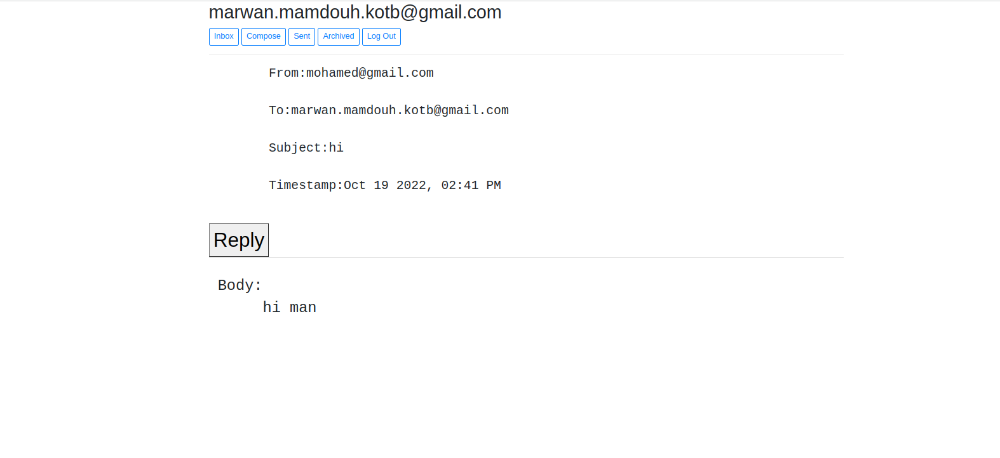

# MailApp

<table>
<tr>
<td>
  Mail project simulates Gmail
</td>
</tr>
</table>


## Installation and Running
    
- Run the server

    ```bash
    python manage.py runserver
    ```
- Finally, goto the website on 127.0.0.1:8000


## view of running code

# 
# 
# 
# 
# 
# 
# 


